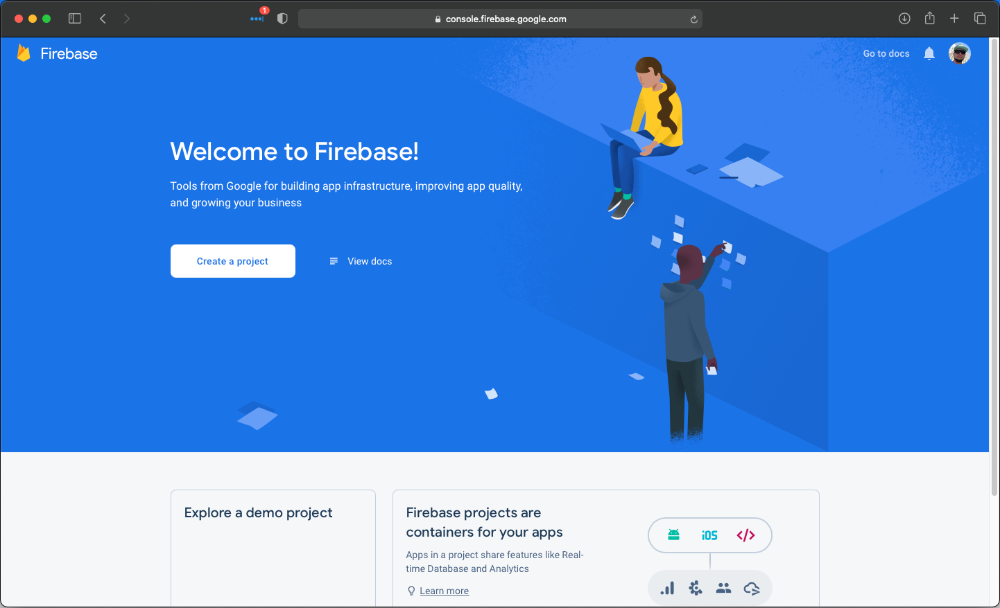
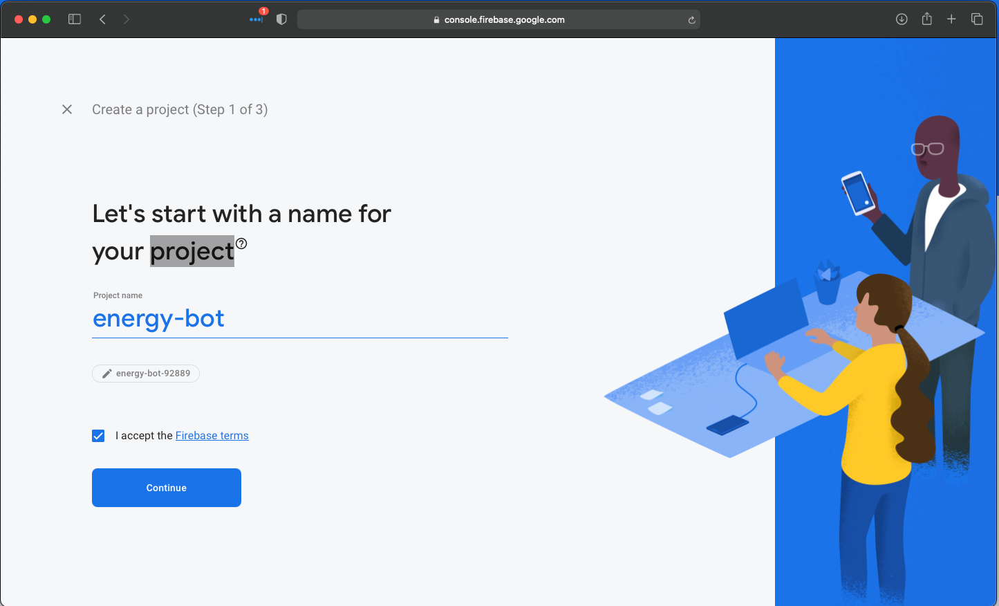
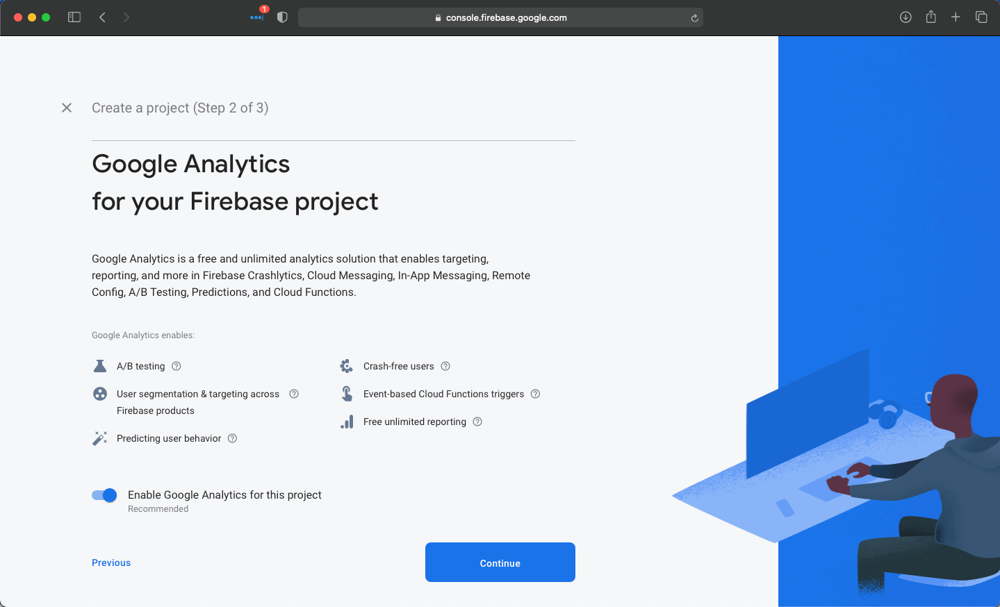
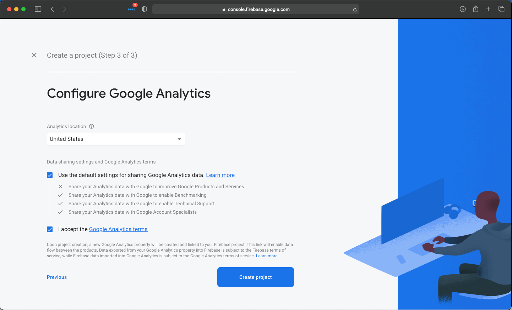
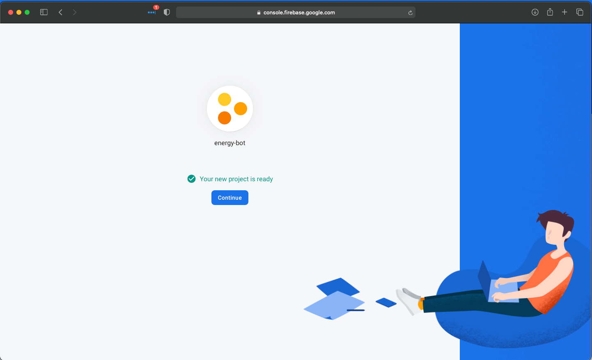
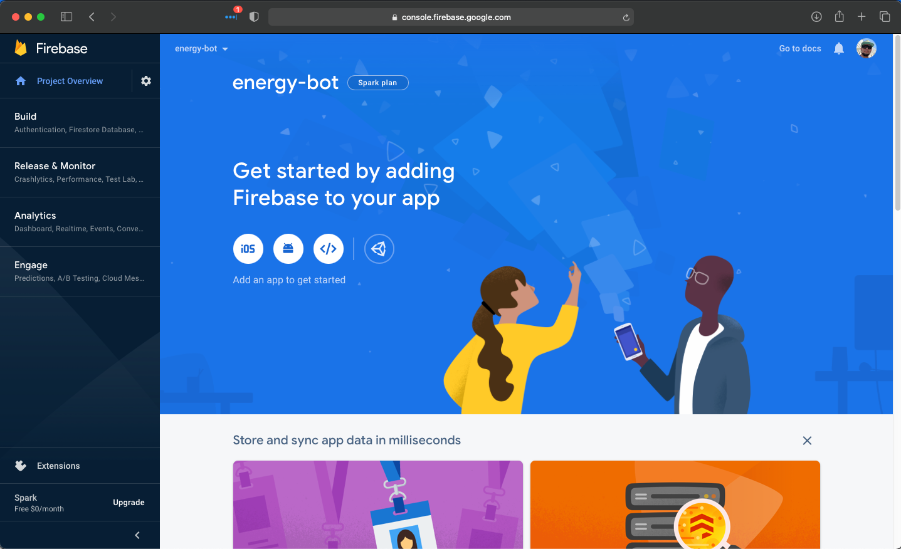
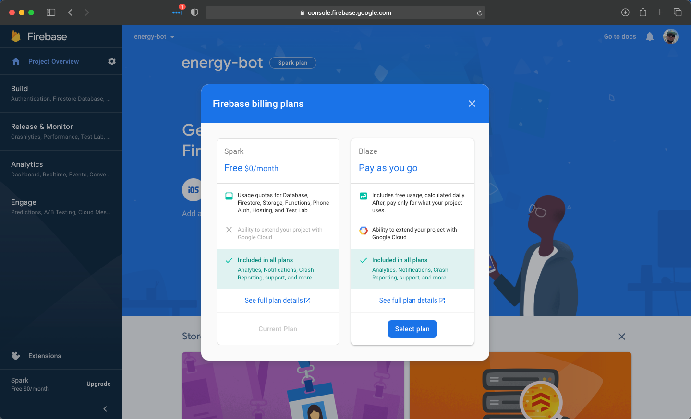
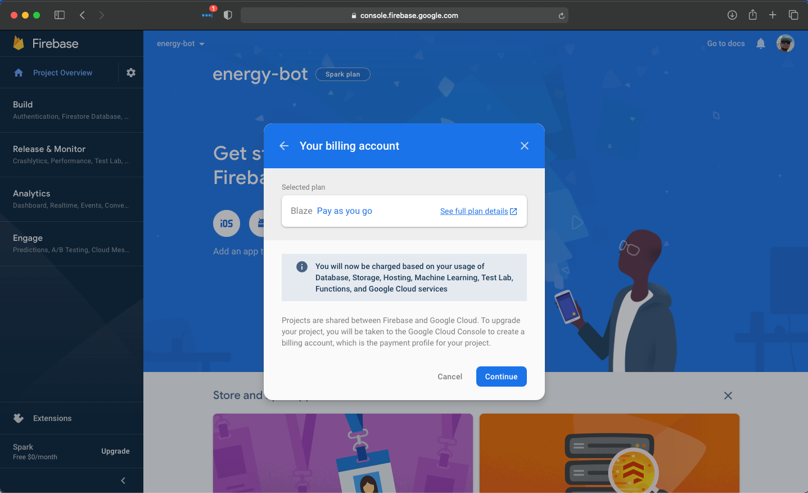

# energy-bot
Friendly and community driven bot to be used with Energy Blast TradingView script or any other. Designed to be deployed
to Google Firebase to allow users who are not tech-savvy to easily set up the bot.

*THIS SOFTWARE COMES WITH NO WARRANTY!*

*USE AT YOUR OWN RISK! ALWAYS TEST IN BYBIT TEST BEFORE USING ON REAL MONEY!*

## Pre-requirements for Installation

The following are required before beginning the Installation

* Bybit Account
* TradingView Account
* Google Account
* Modern Web browser

## Requests

### UP - Returns 200 if energy-bot is running
```http
GET /scaper/up
```

### Config Validate - Returns 200 if config validation passes and can connect to bybit

```http
GET /scaper/config/validate
```

### Places an order on bybit - Returns 200 if order was successful
```http
POST /scalper
```
| Parameter | Type | Description |
| :--- | :--- | :--- |
| `bot` | `string` | **Required**. Bot number you want the order to execute on |
| `order` | `string` | **Required**. Order type sell or buy |
| `symbol` | `string` | **Required**. Symbol order should be placed |
| `contracts` | `string` | **Required**. Number of contracts |
| `auth_key` | `string` | **Required**. Auth key set as part of configuration |
| `leverage` | `string` | **Required**. Leverage to use for the order |

```json
{
    "bot": "1",
    "order": "buy",
    "symbol": "BTCUSD",
    "contracts": 1000,
    "auth_key": "replace with auth key you configured",
    "leverage": "1"
}
```

## Installation

1. Create Firebase Project for Deployment
   * Open Web Browser of choice and navigate to https://console.firebase.google.com
     * if you are not logged into your google account you will be asked to sign in    

    * Click *Create a project* button
    * Type *energy-bot* in Project name field
    * Check *I accept the firebase terms* box
    
    * Click *Continue* button  
   * Click *Continue* button on Google Analytics page
   
     * Click *Create Project* button on Configure Google Analytics page
    
       * Wait for project to finish creating once done Click *Continue button
         
2. Upgrade Firebase Project to Blaze
* Click *Upgrade* button on bottom right corner of screen 

  * Click *Select Plan* button to upgrade firebase project to Blaze (This is required to run webhooks in firebase)
    
    * Click *Continue* button
    
      * Click *Continue* button
     # TODO need to fix this one to not have PII
        # TODO finish this
3. Install Firebase CLI (This is a command line tool that is used to interact with google firebase platform and preform
   the bot deployment)
    * Download Firebase cli
      * Windows https://firebase.tools/bin/win/instant/latest
      * MacOS
4. Login to firebase CLI
   * Open terminal window
     * Windows 
     * MacOS
5. Generate ByBit API keys
   * Login to bybit account
    ** Test URL
6. Deploy Bot to Firebase
7. Confirm your bot loads
    * In your web browser of choice 
    
## Developing Locally

* Install Firebase CLI
* Run Following commands
```shell
mv ./functions/.runtimeconfig.json.tpl ./functions/.runtimeconfig.json.tpl
# Update .runtimeconfig.json with you keys and settings using your favorite IDE / text editor
vim .runtimeconfig.json
firebase use --add
firebase emulators:start
# Test it is online using your favorite api tests (curl example provided)
curl http://localhost:5001/energy-bot/europe-west1/scalper/up
```
