# Setup
Follow these instructions to set up energy-bot on Google Firebase. They assume this is the first time setting up an
application in google firebase. Steps could be slightly different if you have an app already in firebase.

1. Create Firebase Project for Deployment
    * Open Web Browser of choice and navigate to https://console.firebase.google.com
        * if you are not logged into your google account you will be asked to sign in by entering your google account
        information
    * Click *Create a project* button
    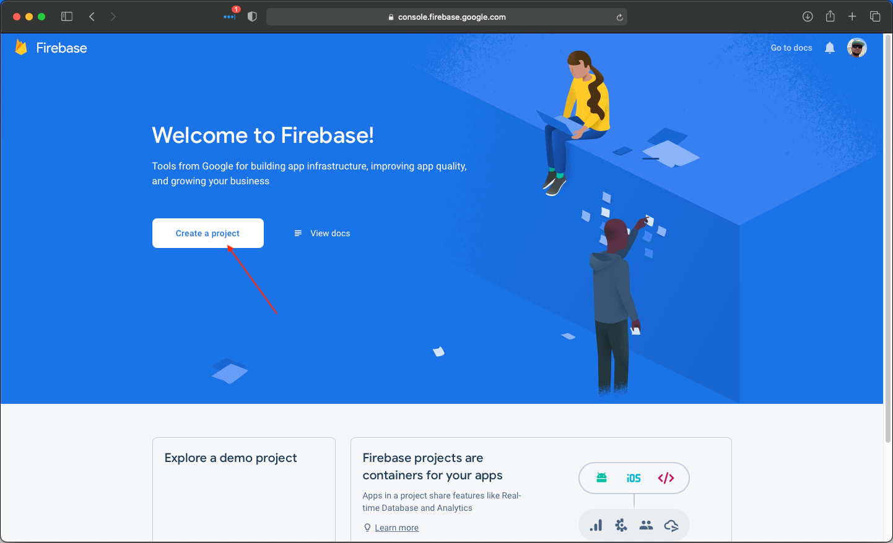
    * Type *energy-bot* in Project name field
    * Check *I accept the firebase terms* box
    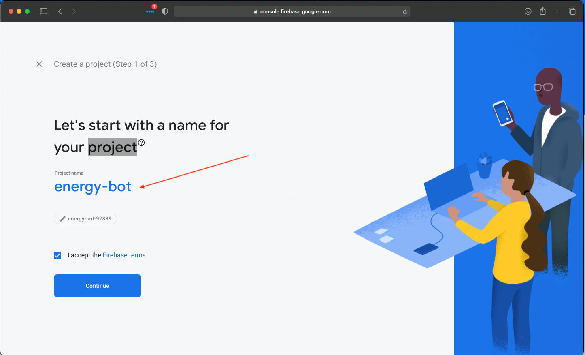
    * Click *Continue* button
    * Click *Continue* button on Google Analytics page
    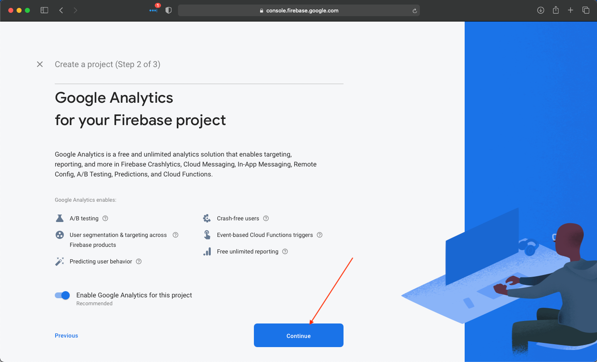
    * Click *Create Project* button on Configure Google Analytics page
    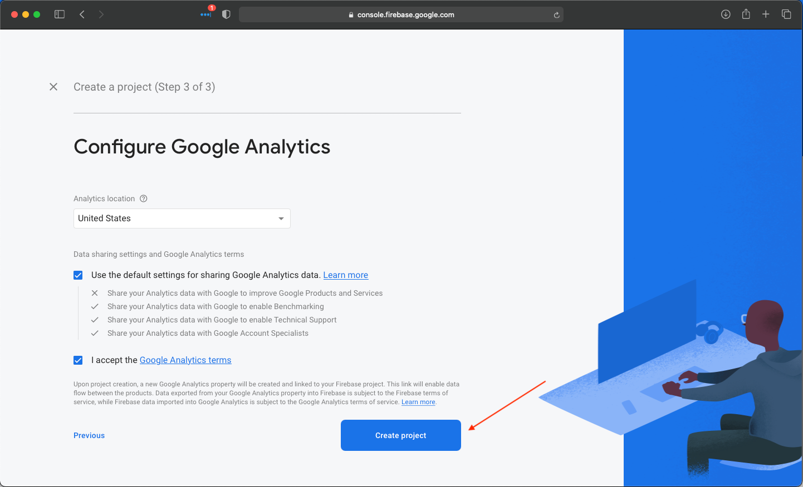
    * Wait for project to finish creating once done Click *Continue* button
    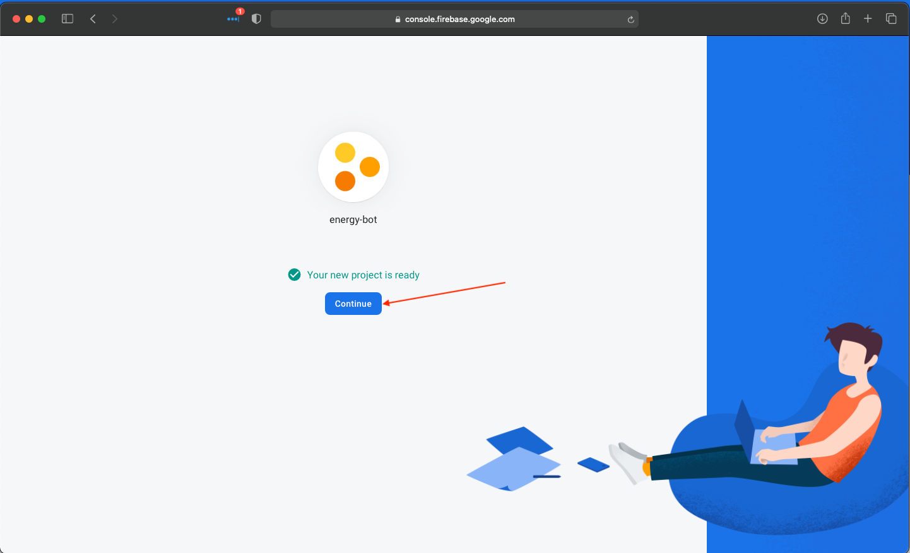
2. Upgrade Firebase Project to Blaze
    * Click *Upgrade* button on bottom right corner of screen
    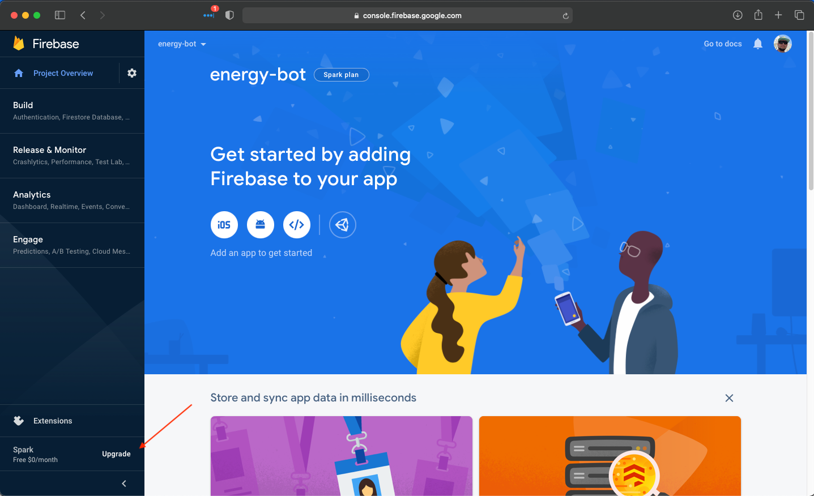
    * Click *Select Plan* button to upgrade firebase project to Blaze (This is required to run webhooks in firebase)
    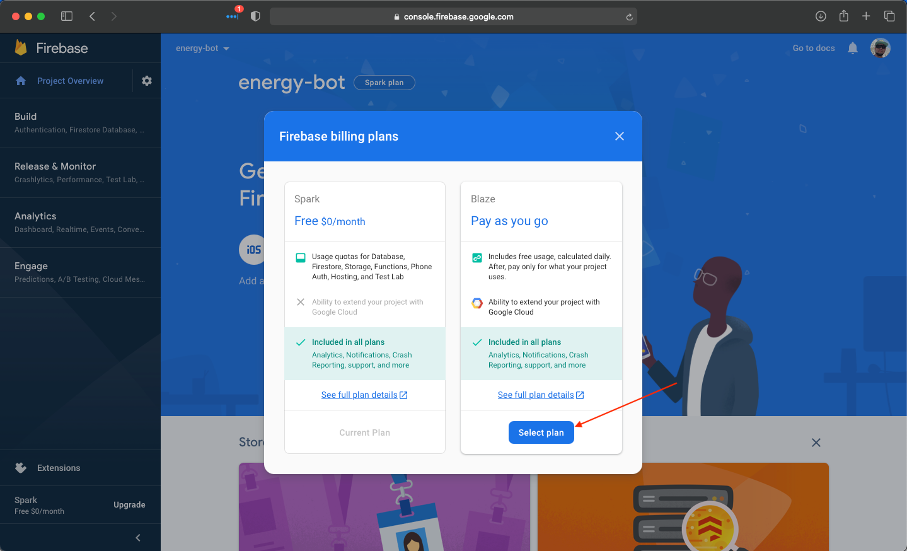
    * Click *Continue* button
    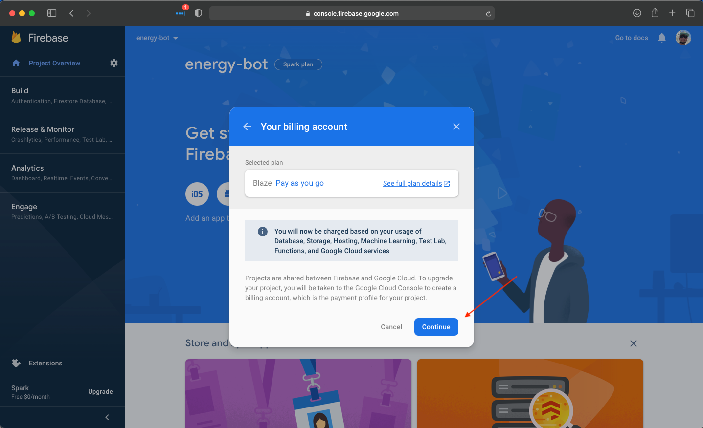
    * Click *Continue* button
    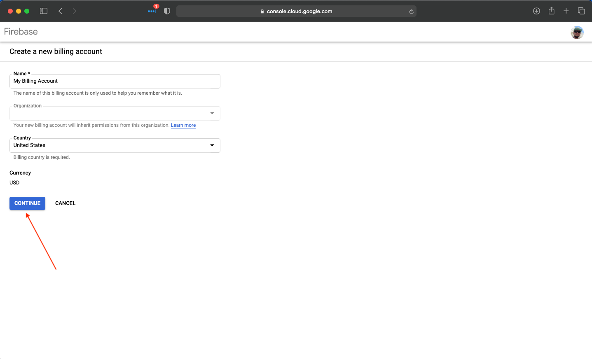
3. Install Firebase CLI (This is a command line tool that is used to interact with google firebase platform and perform
   energy bot deployment)
    * Following instructions for your OS here https://firebase.google.com/docs/cli
4. Generate ByBit API keys (NOTE API KEYS ARE ONLY GOOD FOR 90 DAYS REMEMBER TO ROTATE THEM BEFORE THEY EXPIRE)
    * Login to bybit account
        * TestNet https://testnet.bybit.com/en-US/
        * MainNet https://www.bybit.com/
    * Navigate to api key generation page by hovering over your account name in the top right and selecting *API* 
    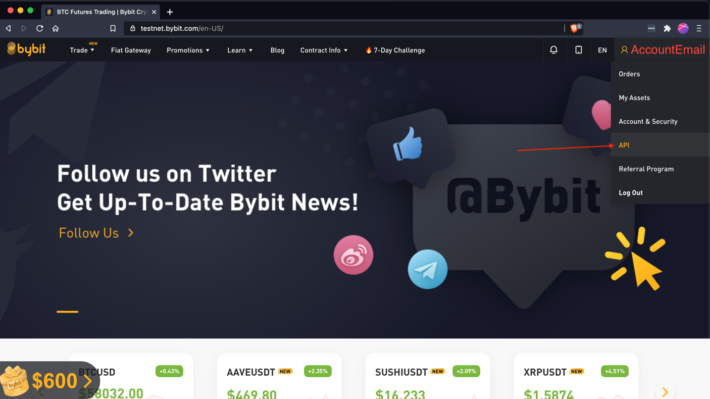
    * Click Create New Key
    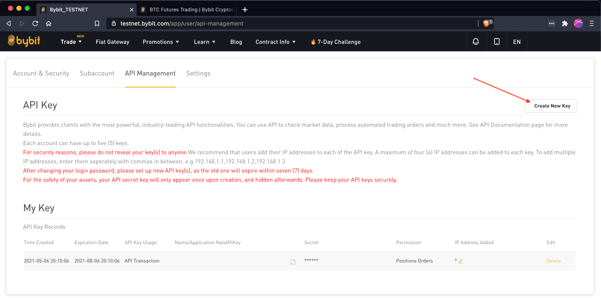
    * On popout box
        * Enter energy-bot under Name field
        * Under *Add Your IP Address* section leave this blank (firebase does not have static ips)
        * Under *API Key permissions* section check *Positions* and *Orders*
        * Enter your Google 2FA code (if you do not have two factor enabled on your account you will have to enable it)
        * Click *Confirm* button
        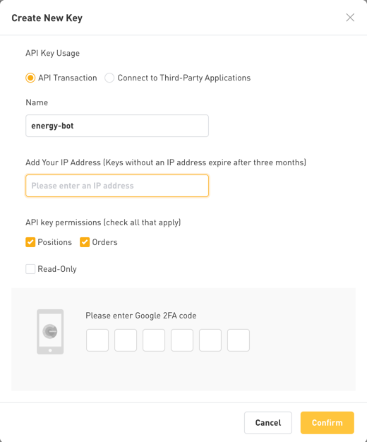
        * A new window will pop up displaying your API keys copy them down to a safe location you will need them for the 
          next step (A password manager is a place good)
        * Once you have copied them down Click *Understood*
        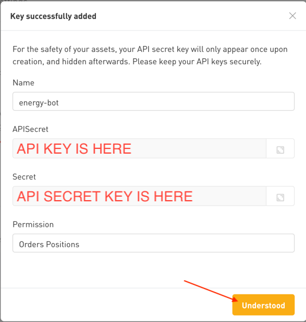
5. Deploy Bot to Firebase by running the following commands in your terminal of choice
    * Windows
        * Open Program *firebase-tools-instant-win.exe*
        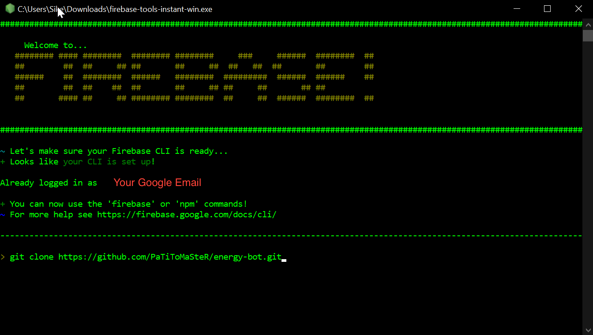
    * Mac OS
       * Open Program *Terminal*
    * Run the following commands in firebase cli (windows) or terminal (mac os)
    ```shell
    cd %USERPROFILE% # for windows
    cd $HOME # for mac os
    # Note if git is not found run the 2nd command
    git clone https://github.com/PaTiToMaSteR/energy-bot.git
    # This one is only needed if first one does not work 
    "%ProgramFiles%\Git\cmd\git.exe" clone https://github.com/PaTiToMaSteR/energy-bot.git
    cd energy-bot
    firebase use --add
    # Select choice that begins with energy-bot using arrows on keyboard and hit enter key
    # When prompted for alias enter 'live' and hit enter key
    firebase functions:config:set bot_1.api_key="REPLACE_WITH_BYBIT_API_KEY_FROM_STEP_4"
    firebase functions:config:set bot_1.secret_key="REPLACE_WITH_BYBIT_SECRET_KEY_FROM_STEP_4"
    firebase functions:config:set bot_1.mode="'test' for testnet bybit or 'live' for normal bybit"
    # NOTE you can repeat the bot config keys to support multiple bots by adding bot_2.api_key bot_2.secret_key bot_2.mode
    # This can be repeated any number of times but must go in number order i.e. you cannot add bot_4.api_key without
    # having a bot 1, 2, and 3 configured first
    firebase functions:config:set auth.key="REPLACE_WITH_RANDOM_STRING_OF_LETTERS_AND_NUMBERS"
    # NOTE recommend the auth key be at least 30 characters long
    # that is what protects your energy-bot setup by random people on the internet think of it like a password
    # save the value you set you will need it when configuring Trading View
    cd functions
    npm install
    cd ../
    firebase deploy
    ```
6. Confirm your bot loads
    * In your web browser of choice go to https://console.firebase.google.com
    * Click *energy-bot*
    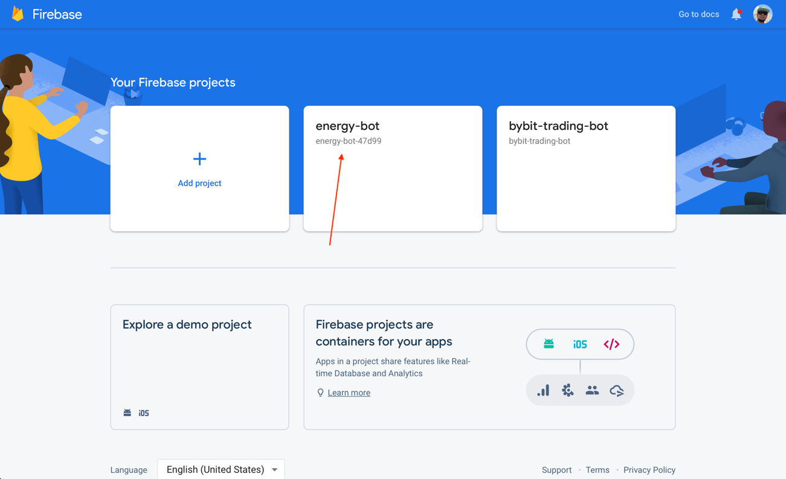
    * Click *Build* a menu will appear then Click *Functions* on left side
    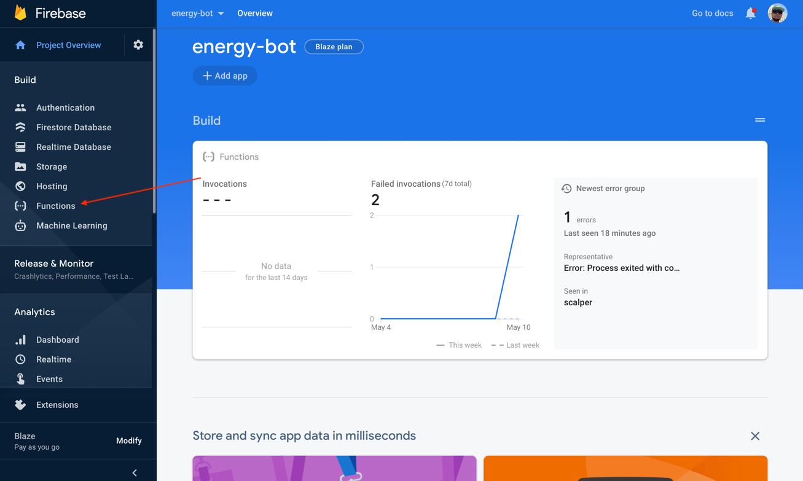
    * Grab Base URL under *Trigger* Column
        * Should be europe-west1-energy-bot-SOMENUMBER-HERE.cloudfunctions.net
        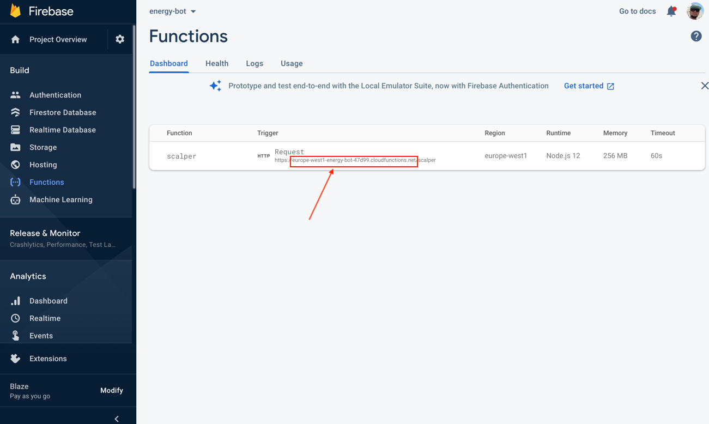
    * In your web browser of choice go to https://REPLACE_WITH_BASE_URL/scalper/up it should display *I'm alive*
    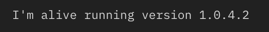
        * If it does not you missed a step above or are using the wrong URL
    * In your web browser of choice go to https://REPLACE_WITH_BASE_URL/scalper/config/validate it should display 
      *Configuration Validation Successful*
    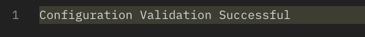
        * If it does not there is a configuration issue look at the output it should tell you want is wrong
7. Step up complete you can now set up trading view alerts to energy-bot!